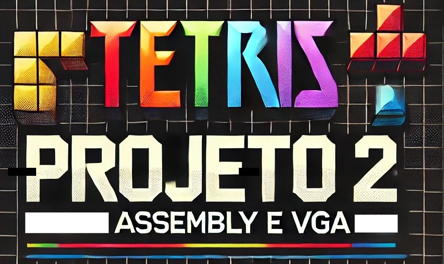
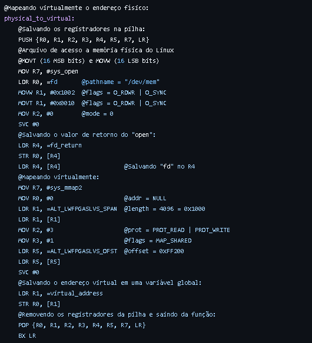
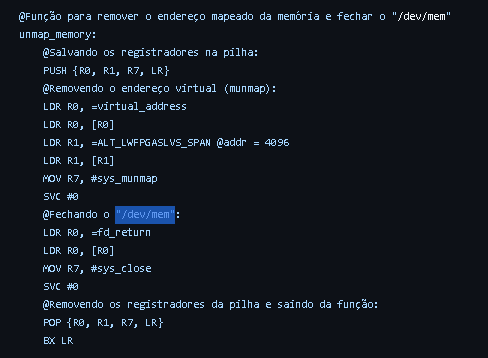
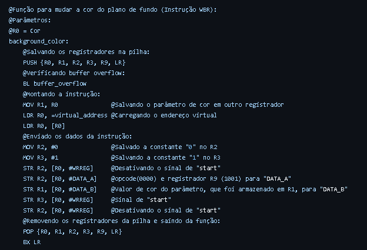
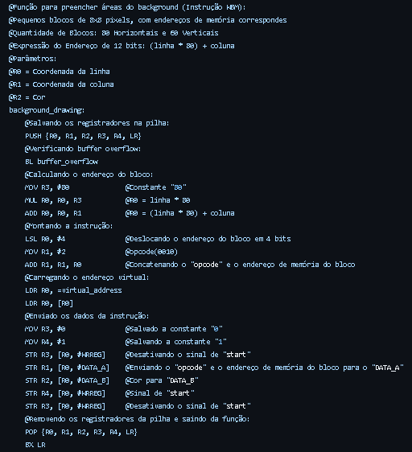
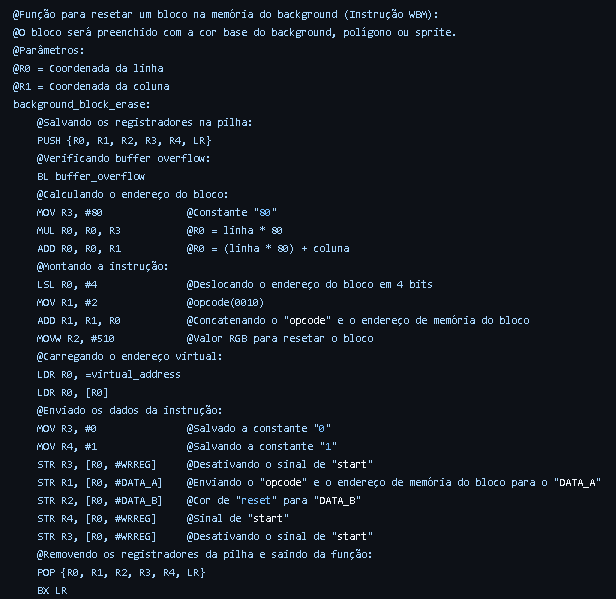
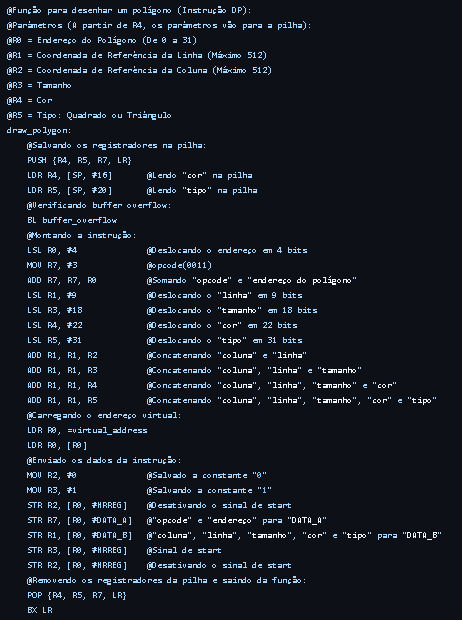
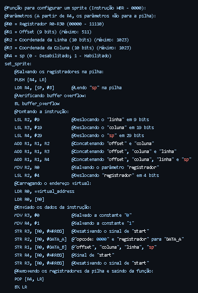
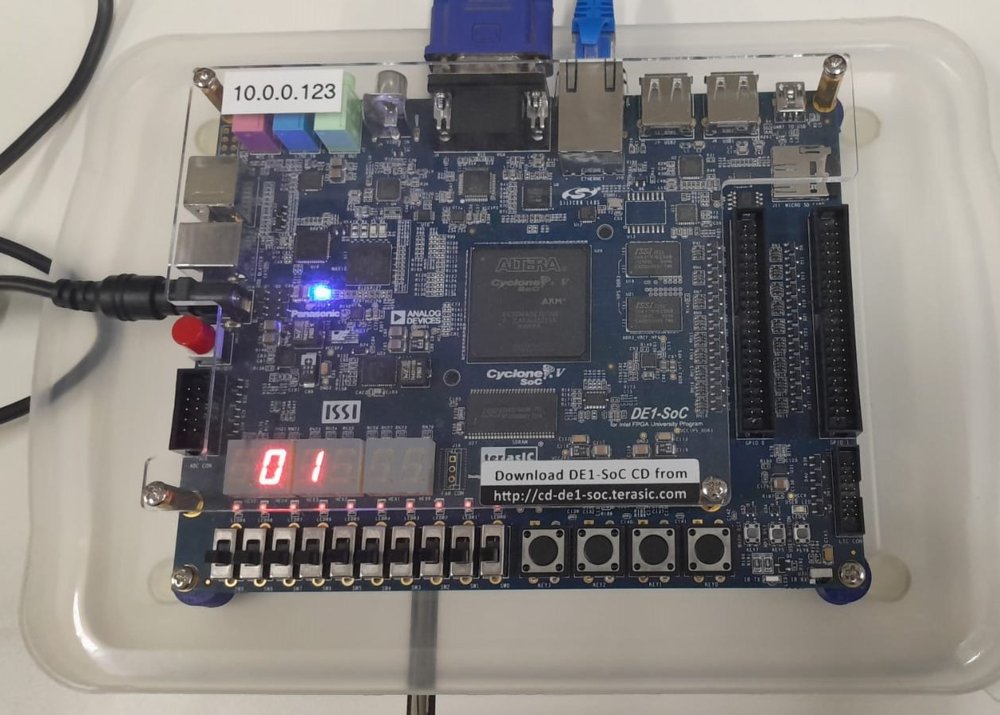

  <h4>Universidade Estadual de Feira de Santana  
    
 Discentes : 
<uL> 
  <li><a href="https://github.com/thejoseviictor">José Victor de Oliveira Correia</a></li>
  <li><a href="https://github.com/Macedoxx2000">João Victor Macedo dos Santos Lima </a></li>
  <li><a href="https://github.com/MateusAntony/MateusAntony">Mateus Antony Medeiros Carvalho </a></li>
  <li><a href="https://github.com/WesleiSantos13">Weslei Silva Santos</a></li>
</ul>

 Turma: 3  
 Grupo: 3  
 Componente: TEC499 - MI-Sistemas digitais  
 Docente: Wild Freitas da Silva  
 Período: 2024.2  
</h4>  

 
 

  
  

  
<strong> </strong>

<h2 align="center">Game inspirado no clássico Tetris, desenvolvido para o kit de desenvolvimento DE1-SoC utilizando linguagem C e Assembly </h2>  

 
 

<h2 align="justify">Introdução</h2>

  

  
  Seguindo o "Projeto 1: Tetris" , o "Projeto 2 : Assembly e VGA" teve como objetivo de desnvolvimento a utilização da linguagem Assembly para exibições gráficas.

  

 
 

<h2 align="justify">Descrição do projeto</h2>

  

  
  O projeto PBL2 teve como objetivo a utilização dos conceitos aprendidos em arquitetura de computadores e sistemas digitais, de forma prática, para a recriação do  jogo tetris, atendendo os seguintes requisitos mínimos:   

  * Utilizar o Kit de desenvolvimento DE1-SoC e os seus respectivos componentes;  
  * O código deve ser escrito em linguagem C, exceto a biblioteca de funções gráficas;  
  * Não é permitido o uso de bibliotecas para o acelerômetro;  
  * O jogo deve pontuar e eliminar agrupamentos
  * Desenvolver uma biblioteca com funções gráficas essenciais para o processador gráfico, escrita em linguagem Assembly;

  
  

 
 

<h2>Descrição de softwares, equipamentos e ferramentas utilizadas: </h2>  

  

  <h3> - Kit de desenvolvimento DE1-SoC: </h3>  
  
  

  O kit de desenvolvimento DE1-SoC, fabricado pela empresa Terasic, é uma placa baseada no chip Intel (Altera) Cyclone V SoC FPGA 5CSEMA5F31C6 e no Processador Dual-Core ARM Cortex-A9. É frequentimente utilizada em projetos educacionais de integração entre hardware e software.

  

  
  

  
<strong>Kit de desenvolvimento DE1-SoC </strong>

 
Os periféricos da placa DE1-SoC usados no projeto foram:

* VGA Out
* Accelerometer
* Button 01
* HPS Gigabit Ethernet
* 7-Segment Displays
* Button x4
  
  

 
  

  <h3> - Linguagem C: </h3>  
  
  

  A linguagem C, criada em 1970, é uma linguagem de programação poderosa pelo seu desempenho e controle excepcional de baixo nível em hardware, manipulação direta de memória, possibilitando acesso a registros de hardware, memória e controle de periféricos. Através disso, ela tem a capacidade de ser utilizada em propositos gerais com mínimas alterações possíveis e assim permitindo um alto grau de compatibilidade. 

  
  

 
 
  

  <h3> - Monitor CTR DELL E773c: </h3>  
  
  

  O monitor utilizado no desenvolvimento do projeto é o "CTR DELL E773c" que utiliza a tecnologia de tubo de raios catódicos para projeção imagens. Possui uma tela de 16 polegadas, resolução máxima de 1280 x 1024 pixels, entrada VGA e com frequência horizontal de até 70 kHz e taxa de atualização vertical de até 160 Hz​. Proporciona um bom contraste e brilho em comparação com outros monitores CRT da período de fabricação.

  

  
  

  
<strong>Monitor CRT DELL E733c</strong>

  
  

 
 
  
  
  <h3> - Visual Studio Code: </h3>  
  
  

  O Visual Studio Code (VS Code) é um editor de código-fonte multiplataforma disponível para Windows, macOS e Linux e desenvolvido pela Microsoft. Oferece suporte nativo para diversas linguagens de programação, como JavaScript, TypeScript, Python, C, C++, Java, PHP, Ruby e permite a instalação de extensões para suportar mais linguagens. Além disso permite sugestões de código, documentação e programação colaborativa em tempo real, e grande capacidade de personalização para atender as preferências do programador.

 

  

  
  

  
<strong></strong>

  

  <a href="https://code.visualstudio.com/">Visual Code Studio</a>
  

  
  

  <h3> - Compilador GNU: </h3>  
  
 

  O <a href="https://gcc.gnu.org/"> GNU Compiler Collection</a>, criado por Richard Stallman, é um conjunto de compiladores desenvolvidos pelo projeto GNU em 1987 com o objetivo de reunir o poder de compilação não só da Linguagem C, mas também C++, Objective-C, Fortran, Ada, Go e entre outros. Tem portabilidade para  Linux, macOS e Windows, alto desempenho e otimização. E por essas características, é um recurso utilizado para o desenvolvimento de projetos envolvendo a comunicação entre software e hardware.

  
 

  

 

<h2>Lógica de jogo</h2>  
  

Nessa seção será tratada a descrição da parte gráfica, movimentação, apresentação de diagrama com a lógica de jogo e imagens oriundas de testes realizados no ambiente de desenvolvimento Laboratório de Eletrônica Digital e Sistemas (LEDS - UEFS).  

 

  

  
  

  
<strong>Diagrama sobre a lógica de jogo</strong>

 

  <h3>- Biblioteca gráfica em Assembly: </h3>  
  
  

  A exibição gráfica, que no "Projeto 1: Tetris" foi feita utilizando a linguagem C e a biblioteca "video.h", agora foi feita utilizando a linguagem Assembly para a criação de uma biblioteca própria para a visualização do jogo. Dentro dessa biblioteca, estão as seguintes funções básicas para o desenvolvimento do jogo:

<h4>  . Função "physical_to_virtual" : </h4>
  

  Função responsável pelo mapeamento virtual do endereço físico, para uso geral em todos os processos gráficos necessários para a jogabilidade do Tetris. Os endereços base são colocados nos registradores R0, R1, R2, R3, R4, R5, R7 e LR, que são inicialmente salvos na pilha e após o agrupamento e retorno do endereço virtual para uma variavel global chamada "virtual_address" , são todos removidos da pilha.

  

  
  

  
<strong>Código assembly da função "physical_to_virtual" </strong>

  

<h4>  . Função "unmap_memory" : </h4>
  

  Função responsável por remover o endereço virtual mapeado da memória e fechar o "/dev/mem". Nessa função os endereços atribuidos aos registradores R0, R1, R7 e LR, salvos na pilha, são limpos. Posteriormente o "/dev/mem" é fechado, os registradores utilizados são removidos da pilha e a função é encerrada.

  

  
  

  
<strong>Código assembly da função "unmap_memory" </strong>

  
  

   <h4>  . Função "buffer_overflow" : </h4>
  

  Função responsável por analisar os buffers de "DATA_A" e "DATA_B" e evitar o overflow desses. Inicialmente ocorre o armazenamento dos registradores R0 e LR na pilha, o endereço virtual é atribuído a R0, compara-se se R0 é igual a 1 (indica overflow) e entra dentro de um looping até o valor mudar para 0 (sem overflow). Após sair do looping,os registradores são removidos da pilha e a função é encerrada.

   

  
  

  
<strong>Código assembly da função "buffer_overflow" </strong>

  

  <h4>  . Função "background_color" : </h4>
  

  Função responsável por mudar a cor do background (plano de fundo da tela). Primeiramente os registradores R0, R1, R2, R3, R9 e LR são salvos na pilha, após isso a função "buffer_overflow" analisa o buffer, o "DATA_A" e "DATA_B" são preenchidos, a cor de fundo é definido e por último os registradores são removidos da pilha e ocorre a saída da função.

  

  
  

  
<strong>Código assembly da função "background_color" </strong>

  <h4>  . Função "background_drawing" : </h4>
  

  Função que desenha o background com uma cor definida na função "background_color" e que tem em R0, R1, R2 , respectivamente, a coordenada da linha, a coordenada da coluna e a cor. Inicialmente os registradores R0, R1, R2, R3, R4 e LR são armaznados na pilha, o buffer é analisado, as constantes são definidas, o cálculo da posição é definido por "R0 = (linha * 80) + coluna", o agrupamento e carregamnto do endreço virtual é realizado para que o background ser exibido. Por ultimo os registradores são removidos da pilha e a função é encerrada.

  
  

  
<strong>Código assembly da função "background_drawing" </strong>

  

  <h4>  . Função "background_block_erase" : </h4>
  

  Função que realiza o apagamento do backgrounde que segue a mesma lógica da função "background_drawing", com a diferença que a cor definida é a mesma cor base do background, para assim as exibições serem encobertas e o processo de limpeza seja realizado.

  

  
  

  
<strong>Código assembly da função "background_block_erase" </strong>

  

  <h4>  . Função "draw_polygon" : </h4>
  

  Função responsável por deesenhar polígonos. Os registradores utilizados são o R0(Endereço do Polígono), R1(Coordenada de Referência da Linha), R2(Coordenada de Referência da Coluna), R3(Tamanho), R4(Cor), R5(Tipo d polígono: Quadrado ou Triângulo), R7 e LR, a partir de R4 os registradores são armazenados na pilha. Após isso o buffer é analisado e as informações são agrupadas para assim definir as características do polígono, o endereço virtual é passado e o polígono é exibido. Ao final, os registradores(R4, R5, R7 e LR) são removidos da pilha e a função é encerrada.

   

  
  

  
<strong>Código assembly da função "draw_polygon" </strong>

  

  <h4>  . Função "set_sprite" : </h4>
  

  Função que define as informações caracteristicas do sprite e ao final o exibe, segue uma lógica parecida com a função "draw_polygon". De início, armazena os registradores R4 e LR na pilha, após isso o buffer é analisado e há o agrupamento das informações definidas nos registradores R0,R1, R2, R3 e R4 e exibe o sprite. Ao final, os registradores são removidos da pilha e a função é encerrada.

  

  
  

  
<strong>Código assembly da função ""set_sprite" </strong>

  

  
 

 

  
  

  
<strong>6 peças utilizadas no projeto.</strong>

 
  
  

  
   
  <em>Tela de início do jogo.</em>

 
  
  

  
   
  <em>Completando linha.</em>

 
  
  

  
   
  <em>Game over e reiniciar jogo.</em>

 

  
  

  <h3>- Movimentação de peças: </h2>
  

  A lógica de movimentação das peças utiliza os sensores de força G do acelerômetro ADXL345, presente no FPGA DE1-SoC Cyclone V. 

  O ADXL345 possui três eixo (X, Y, Z) com alta resolução de medição, porém apenas o eixo X foi usado, permitindo a movimentação das peças no sentido horizontal. 

  A comunicação entre o acelerômetro e o Cyclone V é feita através do serial I2C0, usando o HPS. 

  Para conectar o I2C0 ao ADXL345 é preciso modificar as entradas do bloco de multiplexadores (Pin Mux). Definindo a entrada "1" nos registradores "GENERALIO7/GENERALIO8" e "0" no "I2C0USEFPGA". 

  Antes de instanciar as funções do acelerômetro, é preciso mapear os endereços físicos base do "I2C0" e "SYSMGR" em endereços virtuais. E, em seguida, mapear os registradores restantes através da soma do endereço virtual base com o seu offset. 

  Do mesmo modo, a lógica de movimentação conta com as seguintes funções: 

  <strong> int open_memory(void);</strong> 
  Acessa a memória física do sistema linux, através do diretório "/dev/mem", e retorna "-1", caso ocorra um erro na abertura do arquivo de memória 

  <strong> void enable_I2C0_HPS(int);</strong> 
  Recebe como entrada o inteiro usando na função "open_memory". 
  Habilita a comunicação do ADXL345 com o I2C0, através do bloco de multiplexadores no módulo "sysmgr", usando os pinos HPS. 

  <strong>void setting_I2C0_ADXL345(void *);</strong> 
  Recebe como entrada o endereço virtual base do "I2C0". 
  Inicia a comunicação I2C0 e seleciona o "ADXL345" como slave/target. 

  <strong>void setting_ADXL345(volatile unsigned int *);</strong> 
  Recebe como entrada o endereço do registrador "I2C0_DATA". 
  Realiza as calibragens e configurações iniciais dos sensores do ADXL345, com base nas calibragens do "FPGA Academy". 

  <strong>int16_t lerEixoX(volatile unsigned int *, volatile unsigned int *);</strong> 
  Recebe como entradas os endereços dos registradores "I2C0_DATA" e "I2C0_RXFLR". 
  Lê e retorna os valores de medição do eixo X em um inteiro de 16 bits com sinal. 

  Diante do exposto, a função principal faz a leitura do valor do eixo x, para valores maiores do que "+100g" a peça se moverá para a direita, para valores menores do que "-100g" a peça se moverá para a esquerda.

 
  <h2>Exibição de pontuação e início pausa do jogo: </h2>  
  
  

  Para ambas as funcionalidades do jogo, foi utilizada a GPIO - General-Purpose Input/Output (ou no português, entrada/saída de uso geral), estrutura da placa DE1-SoC que permite a comunicação com periféricos. E respectivamente para a exibição da pontuação e pausa do jogo foram utilizados o display de 7 segmentos e os botões.

   <h3> - Display de 7 segmentos: </h3>  
  
  

 A placa DE1-SoC tem 6 displays de 7 segmentos mais ponto(.) que são organizados em 3 blocos, cada bloco com 2 pares de displays para exibição de números e caracteres. Cada unidade é nomeada de HEX5, HEX4, HEX3, HEX2, HEX1 e HEX0 (na ordem da esquerda para a direta) e cada segmento é identificado como HEXN[0], HEXN[1], HEXN[2], HEXN[3], HEXN[4], HEXN[5] e HEXN[6] (desconsiderando o ponto), como pode ser visto na imagem a seguir:

  
   
  <em>Conexões entre o display de 7 segmentos HEX0 e o Cyclone V SoC FPGA .</em>

 
 O comportamento dos displays seguem a lógica que podemos chamar de "negativa", logo com o bit O o segmento pode ser ligado e com o bit 1 pode ser desligado, aplicando um nível lógico baixo ou alto nível lógico do FPGA, respectivamente.

 No projeto 2, o código feito para a exibição da pontuação do jogo foi escrito em linguagem C e o limite da pontuação foi definido como 99 pontos. 
 As funções utilizadas do arquivo "GPIO.c" são "return_decomposto" e "exibir_pontos". Na primeira função o valor da pontuação é decomposto em dezena e unidade, armazenados em um vetor e retornado para a segunda função. De acordo com os valores armazenados em cada célula do vetor e também através da lógica condicional formulada, os HEX's HEX4 e HEX3 recebem os respectivos offsets em hexadecimal responsável pela exibição do número desejado.
 Abaixo seguem a correspondência binária e hexadecimal para cada número e uma imagem de exibição da pontuação quando o valor foi acrescido :

  
| Dígito | Binário ( Lógica negativa) | Hexadecimal |
|:---------------: |:-------------------:| :--------------:|
| Segmentos apagados | 11111111 | FF |
| 0 | 11000000 | C0 |
| 1 | 11111001 | F9 |
| 2 | 110100100 | 1A4 |
| 3 | 10110000 | B0 |
| 4 | 10011001 | 99 |
| 5 | 10010010 | 92 |
| 6 | 10000010 | 82 |
| 7 | 11111000 | F8 |
| 8 | 10000000 | 80 |
| 9 | 10010000 | 90 |

 

 
 

  
   
  <em>Exibição de pontos no display.</em>

 

  

 <h3> - Botões: </h3>  
  

A placa DE1-SoC tem 4 botões, nomeados de KEY0, KEY1, KEY2 E KEY3 (no sentido direita para a esquerda). Assim como os displays de 7 segmentos, os botões também seguem a lógica "negativa", e quando ele é pressionado retorna 0 e quando não é retorna 1. O conjunto de 4 bits(0x1111) define quais botões são pressionados no momento.

  
   
  <em>Conexões entre os LEDs e o Cyclone V SoC FPGA
.</em>

Abaixo há a relação binária-hexadcimal entre as saídas dos botões ao estarem ou não pressionados:
 

  
  | Botão | Binário ( Lógica negativa) | Hexadecimal |
|:---------------: |:-------------------:| :--------------:|
| Nenhum botão pressionado | 1111 | F |
| 0 | 1110 | E |
| 1 | 1101 | D |
| 2 | 1011 | B |
| 3 | 0111 | 7 |

No projeto 2 esses periféricos, definidos na função "button" foram usados para criar as lógicas de iniciar, pausar e continuar jogabilidade no jogo tetris e foram escritas em linguagem C. Na tela de início, ao pressionar o KEY0, o jogo ínicia. Já na execução da jogabilidade, caso o KEY0 seja pressionado ocorre a execução da pausa. Para retornar a continuidade do jogo foi usada a KEY1, quando ela é pressionada o jogo volta ao seu último estado de execução.

  
   
  <em>Pausa e continuidade do jogo.</em>

 
 

<h2>Conclusões</h2>

Como resultado, obteve-se um jogo de Tetris funcional implementado na DE1-SoC Cyclone V , utilizando o acelerômetro ADXL345 para controlar a movimentação das peças e a criação da biblioteca de processamento gráfico basseada na linguagem Assembly. O jogo permite interagir de forma intuitiva, movendo as peças para a esquerda ou direita e realizando rotações, dependendo da inclinação do dispositivo. Todos os requisitos foram cumpridos. Não houve gestão de tempo suficiente para implementar funcionalidades a mais.

 
 

<h2>Referências</h2>

WIJMAN, Tom. New free report: Explore the global games market in 2023. [S. l.], 8 ago. 2023. Disponível em: https://newzoo.com/resources/blog/explore-the-global-games-market-in-2023 . Acesso em: 25 set. 2024.    

INTEL CORPORATION. Cyclone V HPS Register Address Map and Definitions. [S. l.], 2012. Disponível em: https://www.intel.com/content/www/us/en/programmable/hps/cyclone-v/hps.html. Acesso em: 20 set. 2024.   

FPGACADEMY. Lab 7 - Using the ADXL345 Accelerometer. [S. l.], 2021. Disponível em: https://fpgacademy.org/courses.html. Acesso em: 6 set. 2024.   

ROSS, Matt. Dell E773c. [S. l.], 30 ago. 2024. Disponível em: https://crtdatabase.com/crts/dell/dell-e773c. Acesso em: 25 set. 2024.   

INTEL CORPORATION. FPGAcademy Boards. [S. l.], 2021. Disponível em: https://fpgacademy.org/boards.html. Acesso em: 6 set. 2024.  

LEDS - LABORATÓRIO DE ELETRÔNICA DIGITAL E SISTEMAS. Recursos. [S. l.], 2022. Disponível em: https://sites.google.com/uefs.br/ltec3-leds. Acesso em: 28 ago. 2024.  

