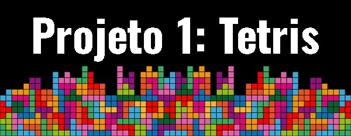

  <h4>Universidade Estadual de Feira de Santana  
    
 Discentes : 
<uL> 
  <li><a href="https://github.com/thejoseviictor">José Victor de Oliveira Correia</a></li>
  <li><a href="https://github.com/Macedoxx2000">João Victor Macedo dos Santos Lima </a></li>
  <li><a href="https://github.com/MateusAntony/MateusAntony">Mateus Antony Medeiros Carvalho </a></li>
  <li><a href="https://github.com/WesleiSantos13">Weslei Silva Santos</a></li>
</ul>

 Turma: 3  
 Grupo: 3  
 Componente: TEC499 - MI-Sistemas digitais  
 Docente: Wild Freitas da Silva  
 Período: 2024.2  
</h4>  

 
 

  
  

  
<strong> </strong>

<h2 align="center">Game inspirado no clássico Tetris, desenvolvido para o kit de desenvolvimento DE1-SoC utilizando linguagem C </h2>  

 
 

<h2 align="justify">Introdução</h2>

  

  
  No mundo da computação, seja ele dividido em software ou hardware, muitas pessoas se utilizam e aproveitam das quase infinitas possibilidades de conhecimentos e          ferramentas para serem utilizadas no dia a dia de forma produtiva e eficiente para as mais diversas funcionalidades e objetivos.  

  Uma das vertentes é a área de jogos, que hoje é considerada uma gigantesca parte do entretenimento e mercado global (que faturou cerca de $187,7 bilhões em 2023) . A     cada ano que passa, o mundo dos games se torna mais avançado, em quesitos de memória, gráfico, comunicação online e armazenamento em nuvem.  

  Entretanto, a nossa inspiração para o projeto remota ao ano de 1984, quando o pesquisador soviético Alexey Pajitnov desenvolveu o seu primeiro modelo do Tetris.  

  

 
 

<h2 align="justify">Descrição do projeto</h2>

  

  
  O projeto PBL1 teve como objetivo a utilização dos conceitos aprendidos em arquitetura de computadores e sistemas digitais, de forma prática, para a recriação do  jogo   tetris, atendendo os seguintes requisitos mínimos:   

  * Utilizar o Kit de desenvolvimento DE1-SoC e os seus respectivos componentes;  
  * O código deve ser escrito em linguagem C;  
  * Não é permitido o uso de bibliotecas para o acelerômetro;  
  * O jogo deve pontuar e eliminar agrupamentos.  

  
  

 
 

<h2>Descrição de softwares, equipamentos e ferramentas utilizadas: </h2>  

  

  <h3> - Kit de desenvolvimento DE1-SoC: </h3>  
  
  

  O kit de desenvolvimento DE1-SoC, fabricado pela empresa Terasic, é uma placa baseada no chip Intel (Altera) Cyclone V SoC FPGA 5CSEMA5F31C6 e no Processador Dual-Core ARM Cortex-A9. É frequentimente utilizada em projetos educacionais de integração entre hardware e software.

  

  
  

  
<strong>Kit de desenvolvimento DE1-SoC </strong>

 
Os periféricos da placa DE1-SoC usados no projeto foram:

* VGA Out
* Accelerometer
* Button 01
* HPS Gigabit Ethernet
  
  

 
  

  <h3> - Linguagem C: </h3>  
  
  

  A linguagem C, criada em 1970, é uma linguagem de programação poderosa pelo seu desempenho e controle excepcional de baixo nível em hardware, manipulação direta de memória, possibilitando acesso a registros de hardware, memória e controle de periféricos. Através disso, ela tem a capacidade de ser utilizada em propositos gerais com mínimas alterações possíveis e assim permitindo um alto grau de compatibilidade. 

  
  

 
 
  

  <h3> - Monitor CTR DELL E773c: </h3>  
  
  

  O monitor utilizado no desenvolvimento do projeto é o "CTR DELL E773c" que utiliza a tecnologia de tubo de raios catódicos para projeção imagens. Possui uma tela de 16 polegadas, resolução máxima de 1280 x 1024 pixels, entrada VGA e com frequência horizontal de até 70 kHz e taxa de atualização vertical de até 160 Hz​. Proporciona um bom contraste e brilho em comparação com outros monitores CRT da período de fabricação.

  

  
  

  
<strong>Monitor CRT DELL E733c</strong>

  
  

 
 
  
  
  <h3> - Visual Studio Code: </h3>  
  
  

  O Visual Studio Code (VS Code) é um editor de código-fonte multiplataforma disponível para Windows, macOS e Linux e desenvolvido pela Microsoft. Oferece suporte nativo para diversas linguagens de programação, como JavaScript, TypeScript, Python, C, C++, Java, PHP, Ruby e permite a instalação de extensões para suportar mais linguagens. Além disso permite sugestões de código, documentação e programação colaborativa em tempo real, e grande capacidade de personalização para atender as preferências do programador.

 

  

  
  

  
<strong></strong>

  

  <a href="https://code.visualstudio.com/">Visual Code Studio</a>
  

  
  

  <h3> - Compilador GNU: </h3>  
  
 

  O <a href="https://gcc.gnu.org/"> GNU Compiler Collection</a>, criado por Richard Stallman, é um conjunto de compiladores desenvolvidos pelo projeto GNU em 1987 com o objetivo de reunir o poder de compilação não só da Linguagem C, mas também C++, Objective-C, Fortran, Ada, Go e entre outros. Tem portabilidade para  Linux, macOS e Windows, alto desempenho e otimização. E por essas características, é um recurso utilizado para o desenvolvimento de projetos envolvendo a comunicação entre software e hardware.

  
 

  

 

<h2>Lógica de jogo</h2>  
  

Nessa seção será tratada a descrição da parte gráfica, movimentação, apresentação de diagrama com a lógica de jogo e imagens oriundas de testes realizados no ambiente de desenvolvimento Laboratório de Eletrônica Digital e Sistemas (LEDS - UEFS).  

 
 

  

  
  

  
<strong>Diagrama sobre a lógica de jogo</strong>

 
  <h3>- Parte visual e gráfica:</h2>  
  
  

  O jogo foi desenvolvido utilizando uma matriz para reproduzir o cenário, com várias funções criadas para implementar os elementos da interface do Tetris, bem como a lógica que o envolve. Em primeiro lugar foi desenvolvido as estruturas das peças criando uma matriz tridimensional, onde cada elemento do primeiro array faz referencia a um formato de uma elemento.  

Inicialmente, vamos falar da função <strong> desenharBloco().</strong> Essa função tem como objetivo desenhar os blocos do cenário, recebendo como parâmetros a coluna, a linha e a cor do bloco. Considerando que o tabuleiro é uma estrutura lógica composta por linhas e colunas, e que, no monitor, ele ocupa uma quantidade de pixels, precisamos multiplicar os valores da coluna e da linha pelo tamanho da peça para transformar essas posições em coordenadas de pixels na tela. Se não fizermos isso, o bloco será representado apenas como um ponto, e não teremos o design do bloco preenchido.

Nesse sentido, utilizamos a biblioteca <strong>video.h</strong> para exibir algo na tela do VGA. Para isso, empregamos a função <strong>video_box()</strong>, na qual passamos como parâmetros x1 e y1, que determinam o ponto onde o bloco começa em relação ao canto superior esquerdo das colunas e linhas. Também passamos x2 e y2, que representam o canto inferior direito, onde o bloco termina. Com isso, conseguimos criar a função básica para a elaboração de blocos na tela.

A função desenharBlocoTetris() é semelhante à desenharBloco() com uma difenrença que ela desenha blocos com um efeito de espaço entre eles.

A função <strong>desenharCampo()</strong> é responsável por desenhar a borda do jogo, os blocos que estão fixos e a peça em movimento. Para desenhar a borda do jogo, utilizamos a função desenharBloco(), mencionada anteriormente. Na coluna zero e na ultima coluna , colocamos um bloco laranja em cada linha por interação. Além disso, percorremos todas as colunas, posicionando um bloco laranja na última linha a cada iteração, formando assim as bordas do jogo.

Além disso, para desenhar os blocos já fixados no tabuleiro do jogo, o processo foi simples. A matriz do jogo é inicialmente preenchida com zeros, e os blocos têm o valor de um. Ou seja, quando um bloco é fixado, o valor da matriz em uma linha e coluna específicas é alterado, deixando de ser zero. Assim, foi elaborado um loop que percorre toda a matriz, e quando o número um é encontrado, desenhamos um bloco cinza naquela posição.

Para desenhar a peça que está caindo, percorremos toda a matriz da peça e, para cada valor positivo encontrado, desenhamos um bloco. Além disso, foi criada a exibição da pontuação por meio da função <strong>video_text()</strong>, que exibe um texto na tela.

A função de colisão é responsável por garantir que a peça não ultrapasse as delimitações da borda. Essa função recebe a peça como parâmetro e, portanto, percorre todos os blocos da peça. Para cada bloco, verifica se há colisão com as bordas do tabuleiro, com a base ou com outra peça. Assim, foi elaborada uma condição que verifica se alguma parte da peça deseja ocupar uma posição que ultrapassa a borda inferior, a borda direita ou a borda esquerda, além de checar se a posição que a peça deseja ocupar já está ocupada por outra peça. Se houver colisão, a função retorna 1; caso contrário, retorna 0.

Outrossim, a função de fixar a peça que está caindo funciona de maneira semelhante à função que fixa as outras peças já presentes. A diferença é que a posição onde a peça está, naquele momento, adquire o valor 1 na matriz do jogo.

Além disso, existe a função de checagem de linhas, responsável por percorrer todas as linhas e verificar se alguma delas está completa com 1's (blocos). Se houver uma linha completa, ela é removida e os blocos que estão acima se deslocam para baixo. Assim, para cada linha completa o valor de pontuação é incrementado mais 1.

Na função de descida, verifico se há colisão no próximo deslocamento da peça. Se não houver, incremento em um o valor do índice da linha da peça, fazendo-a se deslocar para baixo. No entanto, se houver colisão, a função de fixar a peça é chamada. Isso acontece porque, se existir alguma peça que impeça o deslocamento, significa que a peça em questão deve ser fixada, ou seja, não pode mais se mover, pois isso sobreporia outra peça. Após isso, a função de verificar linha também é chamada, pois, a cada vez que uma peça é fixada, é necessário checar se alguma linha está completa.

A função mover é responsável pelo movimento lateral da peça. Ela analisa se a nova posição resultaria em uma colisão com outra peça ou com as bordas do cenário, por meio da função colisao(). Se não houver colisão, a posição da peça é atualizada, permitindo que ela se mova para o lado desejado. Caso contrário, a nova posição, que está armazenada em uma variável temporária, não é atualizada, e o movimento é impedido.  

 
 

 

  
  

  
<strong>6 peças utilizadas no projeto.</strong>

  
  

  <h3>- Movimentação de peças: </h2>
  

  A lógica de movimentação das peças utiliza os sensores de força G do acelerômetro ADXL345, presente no FPGA DE1-SoC Cyclone V. 

  O ADXL345 possui três eixo (X, Y, Z) com alta resolução de medição, porém apenas o eixo X foi usado, permitindo a movimentação das peças no sentido horizontal. 

  A comunicação entre o acelerômetro e o Cyclone V é feita através do serial I2C0, usando o HPS. 

  Para conectar o I2C0 ao ADXL345 é preciso modificar as entradas do bloco de multiplexadores (Pin Mux). Definindo a entrada "1" nos registradores "GENERALIO7/GENERALIO8" e "0" no "I2C0USEFPGA". 

  Antes de instanciar as funções do acelerômetro, é preciso mapear os endereços físicos base do "I2C0" e "SYSMGR" em endereços virtuais. E, em seguida, mapear os registradores restantes através da soma do endereço virtual base com o seu offset. 

  Do mesmo modo, a lógica de movimentação conta com as seguintes funções: 

  <strong> int open_memory(void);</strong> 
  Acessa a memória física do sistema linux, através do diretório "/dev/mem", e retorna "-1", caso ocorra um erro na abertura do arquivo de memória 

  <strong> void enable_I2C0_HPS(int);</strong> 
  Recebe como entrada o inteiro usando na função "open_memory". 
  Habilita a comunicação do ADXL345 com o I2C0, através do bloco de multiplexadores no módulo "sysmgr", usando os pinos HPS. 

  <strong>void setting_I2C0_ADXL345(void *);</strong> 
  Recebe como entrada o endereço virtual base do "I2C0". 
  Inicia a comunicação I2C0 e seleciona o "ADXL345" como slave/target. 

  <strong>void setting_ADXL345(volatile unsigned int *);</strong> 
  Recebe como entrada o endereço do registrador "I2C0_DATA". 
  Realiza as calibragens e configurações iniciais dos sensores do ADXL345, com base nas calibragens do "FPGA Academy". 

  <strong>int16_t lerEixoX(volatile unsigned int *, volatile unsigned int *);</strong> 
  Recebe como entradas os endereços dos registradores "I2C0_DATA" e "I2C0_RXFLR". 
  Lê e retorna os valores de medição do eixo X em um inteiro de 16 bits com sinal. 

  Diante do exposto, a função principal faz a leitura do valor do eixo x, para valores maiores do que "+100g" a peça se moverá para a direita, para valores menores do que "-100g" a peça se moverá para a esquerda.

 
 

  
   
  <em>1. Apagamento de linha e pontuação.</em>

 

  
   
  <em>2. Pausar e Continuar.</em>

 

  
   
  <em>3. Fim de jogo.</em>

 
 

<h2>Conclusões</h2>

  Como resultado, obteve-se um jogo de Tetris funcional implementado na DE1-SoC Cyclone V , utilizando o acelerômetro ADXL345 para controlar a movimentação das peças. O jogo permite interagir de forma intuitiva, movendo as peças para a esquerda ou direita e realizando rotações, dependendo da inclinação do dispositivo.
  Todos os requisitos foram cumpridos.
  Não houve gestão de tempo suficiente para implementar funcionalidades a mais.

 
 

<h2>Referências</h2>

WIJMAN, Tom. New free report: Explore the global games market in 2023. [S. l.], 8 ago. 2023. Disponível em: https://newzoo.com/resources/blog/explore-the-global-games-market-in-2023 . Acesso em: 25 set. 2024.    

INTEL CORPORATION. Cyclone V HPS Register Address Map and Definitions. [S. l.], 2012. Disponível em: https://www.intel.com/content/www/us/en/programmable/hps/cyclone-v/hps.html. Acesso em: 20 set. 2024.   

FPGACADEMY. Lab 7 - Using the ADXL345 Accelerometer. [S. l.], 2021. Disponível em: https://fpgacademy.org/courses.html. Acesso em: 6 set. 2024.   

ROSS, Matt. Dell E773c. [S. l.], 30 ago. 2024. Disponível em: https://crtdatabase.com/crts/dell/dell-e773c. Acesso em: 25 set. 2024.   

INTEL CORPORATION. FPGAcademy Boards. [S. l.], 2021. Disponível em: https://fpgacademy.org/boards.html. Acesso em: 6 set. 2024.  

LEDS - LABORATÓRIO DE ELETRÔNICA DIGITAL E SISTEMAS. Recursos. [S. l.], 2022. Disponível em: https://sites.google.com/uefs.br/ltec3-leds. Acesso em: 28 ago. 2024.  

